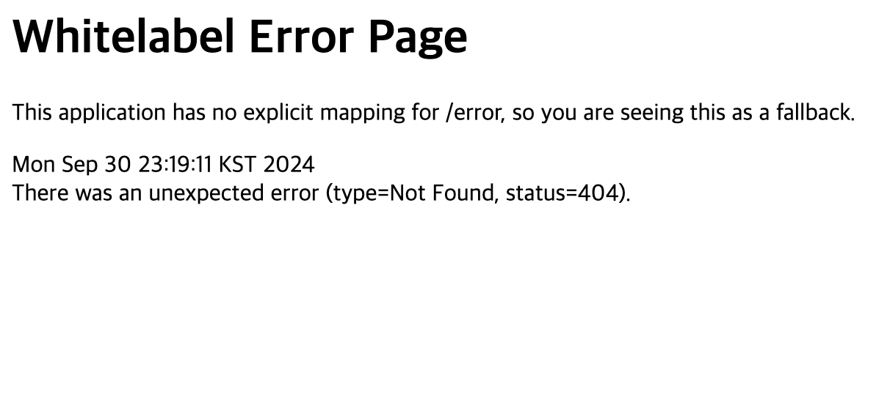

# a. 스터디를 통해 배운 내용

- 웹
  - 웹에서 컴퓨터가 서로 정보를 주고 받는 일반적인 형태는 클라이언트-서버 패러다임

- 클라이언트-서버
  - 클라이언트 : 데이터의 생성/조회/수정/삭제 요청을 전송
  - 서버 : 요청대로 동작을 수행하고 응답을 전송

- HTTP
  - 컴퓨터는 정해진 동작만 수행할 수 있는 기계이고 컴퓨터가 서로 정보를 공유할 때, 정해진 규칙이 필요한데,
  그 규칙을 프로토콜이라 하고, http는 웹에서의 프로토콜의 일종이다.

- 프론트-백엔드
  - 프론트는 화면에 채울 컨텐츠 데이터를 백엔드에게 요청
  - 백엔드는 DB에서 가져온 컨텐츠 데이터를 프론트에게 응답

- API
  - Application Programming Interface
  - 어플리케이션에서 원하는 기능을 수행하기 위해 어플리케이션과 소통하는 구체적인 방법을 정의한 것

---

# b. API 명세서

- 할 일 관리 API)
  - 할 일 생성 : POST /todo
  - 할 일 조회 : GET /todo/list
  - 할 일 수정 : PATCH /todo/{todo_id}
  - 할 일 삭제 : DELETE /todo/{todo_id}
  - 할 일 체크 : POST /todo/{todo_id}/check
  - 할 일 체크 해제 : POST /todo/{todo_id}/uncheck

- 유저 관리 API)

  - 회원 가입
  - 로그인

- 친구 관리 api)

  - 친구 추가
  - 친구 조회
  - 친구 삭제
  - 특정 친구 할 일 조회

# 애플리케이션 싫행 사진

