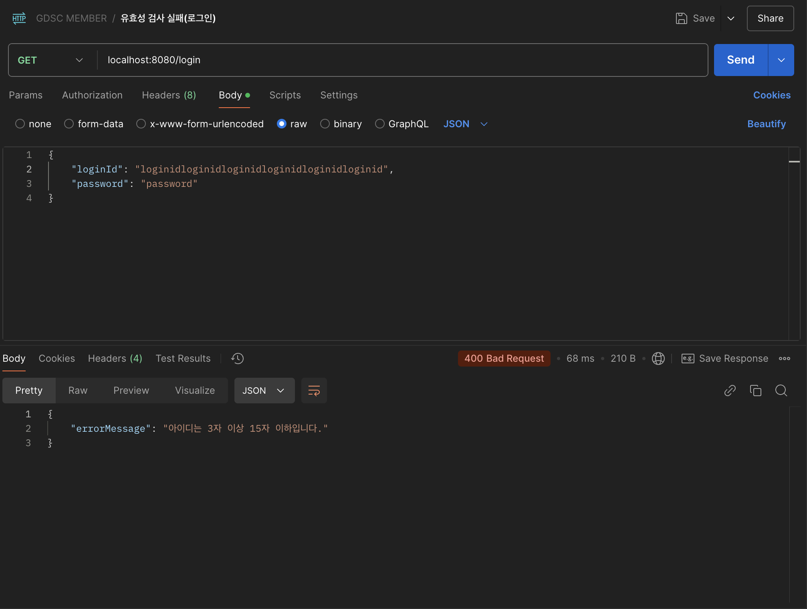
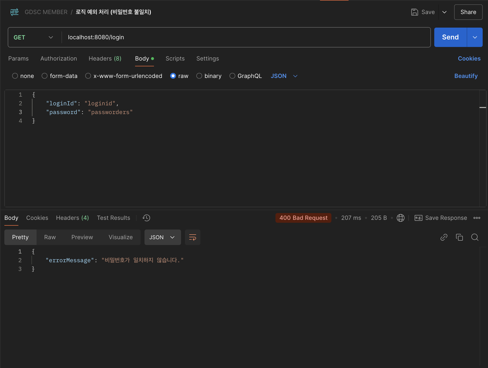

# 10주차 학습 내용

## 유효성 검증
클라이언트가 서버 입장에서 의도하지 않았던 요청을 보낸다면,

서버는 유효성 검사 이후 에러 매세지를 전달할 필요가 있다.

예를 들어, todo api 구현 시 새로운 todo를 입력받는 상황을 가정하자.

클라이언트가 content의 제한 글자 수인 200자를 넘긴다면

데이터가 저장이 되지 않아 정책을 위반하지는 않지만,

클라이언트 입장에서는 500에러를 받게 되어 클라이언트 문제가 아닌, 서버 문제로 인식하게 된다.

예시와 같은 문제를 해결하기 위해, 스프링에서는 DTO에서 유효성 검사를 실시한다.

절차는 크게 다음과 같다.

1. `build.gradle`에 외부 의존성을 추가
	```gradle
	implementation 'org.springframework.boot:spring-boot-starter-validation'
	```
2. DTO 클래스 필드에 필요한 어노테이션 추가
	```java
	// 예시
	@Mix
	@Max
	@NotNull
	```
3. DTO 클래스를 통해 요청을 받는 controller 클래스 매개변수에 `@Valid` 어노테이션 추가

4. Postman을 통하여, 클라이언트가 400에러를 받음으로써 유효성 검증이 정상적으로 진행돠었음을 확인

## 예외 처리

### Global Exception Handler
Spring Application 전역의 모든 에러에 대한 처리 방법을 결정한다.

예외 종류에 따라 응답할 response를 따로 설정하여, 만약 해당 에러가 발생한다면

Global Exception Handler의 메소드가 대신 http 응답을 전송하도록 구현한다.

- 클래스에 `@ControllerAdvice` 어노테이션 추가
- 각 메소드에 `@ExceptionHandler(value=<>)` 추가, value에는 처리하고자 하는 예외 유형(ex. BadRequestException.class)을 대입 
- 예외를 커스텀한 후, 커스텀 예외를 처리하는 Exception Handler를 구현할 수도 있다.

## 에러 메세지 클래스

에러 메세지가 여러 곳에 중복 사용된다면, 메시지를 추가하거나 수정할 사항이 생길 때 번거로워진다.

중복 사용되는 에러 매세지의 유지 및 보수, 관리가 쉽도록 에러 메세지를 클래스 내의 상수로 선언할 수 있다. 

## Aspect-Oriented Programming(AOP)
### 관점 지향 프로그래밍

객체 지향 개념을 보완하는 개념으로 등장했다.
- aspect: 공통 기능
- join point : 애플리케이션 실행 흐름에서의 특정 포인트(ex. 메서드 호출, 예외 발생)
- advice : 조인포인트에서 실행되는 코드

## 느낀 점
이전 주차 스터디에 controller를 구현하며 포스트맨으로 테스트를 진행하던 중,

에러가 났을 때 구체적인 메세지를 서버 쪽 로그가 아닌 클라이언트가 읽을 수 있도록

예외 처리를 할 수 있지 않을까 의문이 들었었다.

과제하면서 궁금했던 예외 처리 내용을 학습하고 구현할 수 있었기에, 이번 주차는 전보다 더 몰입하였던 것 같다.


## 포스트맨 테스트 스크린샷

### 테스트 세팅
h2-console에서 아래의 sql문을 입력하여 테스트 환경을 구축하였다.
```sql
INSERT INTO MEMBER VALUES ();
INSERT INTO MEMBER VALUES ();
INSERT INTO MEMBER VALUES ();
INSERT INTO MEMBER VALUES ();
INSERT INTO MEMBER(member_id, member_login_id, member_pw) VALUES (10, 'loginid', 'password');


INSERT INTO FRIEND(friend_id, sender_id, receiver_id ,status) VALUES (1, 1, 2, 'pending');
INSERT INTO FRIEND(friend_id, sender_id, receiver_id ,status) VALUES (2, 1, 3, 'pending');
INSERT INTO FRIEND(friend_id, sender_id, receiver_id ,status) VALUES (3, 2, 4, 'pending');


INSERT INTO TODO(todo_id, todo_content, todo_is_check, member_id)
    VALUES(1, 'content1', false, 1);
INSERT INTO TODO(todo_id, todo_content, todo_is_check, member_id)
    VALUES(2, 'content2', true, 2);
INSERT INTO TODO(todo_id, todo_content, todo_is_check, member_id)
    VALUES(3, 'content3', false, 1);
INSERT INTO TODO(todo_id, todo_content, todo_is_check, member_id)
    VALUES(4, 'content4', false, 3);
```

### 테스트 결과(Member 로그인)
#### 유효성 검사 실패
클라이언트가 로그인 시 글자수 제한(3~15자)을 넘긴 아이디를 입력하였음.


#### 비즈니스 로직 에러
클라이언트가 로그인 시 아이디는 일치하였으나, 비밀번호가 일치하지 않음.
