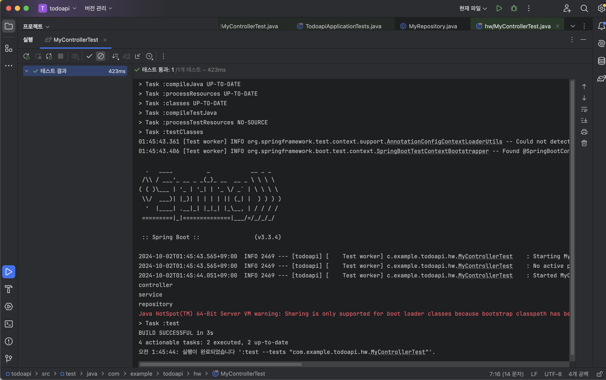

# 3주차 학습 내용

## 스프링
- JAVA 진영의 대표적인 백엔드 프레임워크 
- 객체지향 원칙을 지키면서 개발할 수 있도록 도와준다. 

## 스프링 부트
- 스프링 프레임워크를 사용하여 개발할 때 편의를 더해주는 도구 

## 스프링 빈 (Spring Bean)
- 어플리케이션 전역에서 사용할 공용 객체 
- 스프링 컨테이너에 빈(Bean)을 저장해두고, 필요한 빈을 컨테이너에서 받아 사용한다. 
필요한 빈은 스프링 프레임워크가 자동으로 가져다 준다. 
- 이때 빈을 요구하는 객체도 스프링 빈이다. 
(빈이 아닌 객체가 빈을 요구해도 프레임워크가 자동으로 가져다주지는 못한다) 

## 스프링 컨테이너
- 스프링 빈이 저장되는 공간 
- 어플리케이션 컨텍스트(Application Context) 라고도 한다. 

## 스프링 빈 저장
스프링 빈을 스프링 컨테이너에 저장하는 2가지 방법 :
- 설정 파일 작성 (수동 등록)
- 컴포넌트 스캔 (자동 등록)

1. 설정 파일 저장
  설정 파일 작성 
  - 설정 파일은 자바 클래스로 작성한다. 
  - 이때 클래스에 @Configuration 으로 설정 파일임을 명시한다. 

2. 컴포넌트 스캔
  컴포넌트 스캔 
  - 빈을 생성할 클래스에 @Component 어노테이션 사용 
  - 어플리케이션을 시작할 때 @Component가 붙은 클래스를 찾아서 자동으로 빈 등록 
  - 컴포넌트 스캔은 @ComponentScan 어노테이션 사용 

## 결론
스프링 빈 등록 정리 
- 설정 파일 작성 @Configuration, @Bean 
- 컴포넌트 스캔 @Component, @ComponentScan 

---
## 의존성 주입
- 빈을 사용할 때는 컨테이너에 직접 접근해서 빈을 꺼내지 않고, 
프레임워크에게 필요한 빈(의존성)을 요청하고 받아서 사용한다. 

- 의존성 주입 (Dependency Injection, DI) 
: 내가 의존하는 객체를 직접 생성하지 않고 밖에서 주입 받는 것 

- 스프링에서는 컨테이너에 저장된 빈(객체)과 빈(객체)사이의 의존성을 프레임워크가 주입하는 것을 말한다. 

### Cf) 빈이 아닌 객체에 빈을 자동으로 주입할 수는 없다.
스프링이 빈을 주입하려면, 
두 객체 모두 스프링에 의해 관리 (=빈으로 등록) 되어야 하기 때문이다. 

## 의존성을 주입 받는 이유
- 객체 지향 원칙 중 하나인 OCP(Open Close Principle) 원칙을 준수한다. 
(= 필요한 객체를 하드코딩하지 않으므로 유지 보수하기 좋아진다) 
- 매번 필요한 객체를 생성하는 대신 생성해 놓은 객체를 사용하므로 메모리를 효율적으로 사용할 수 있다. 

## 의존성 주입 방법
- 생성자 주입
- 필드 주입
- 세터 주입 (메서드 주입)

### 1) 생성자 주입
- 필요한 의존성을 final 키워드를 사용해 추가한다. 
- @RequiredArgsConstructor를 사용해 생성자를 추가한다. 

### 2) 필드 주입
- 필드에 바로 @Autowired 어노테이션을 사용한다. (final은 사용 불가) 
- 이 방식은 주로 테스트 코드에서 사용한다. 
- 클래스에 @SpringBootTest 어노테이션을 사용하면 어플리케이션에 있는 모든 빈을 컨테이너에 등록한 후 테스트한다. 
- 스프링 부트까지 실행시키므로, 통합 테스트에도 사용할 수 있다. 

---
## 스프링 Layered Architecture

  ### 컨트롤러
  - 클라이언트의 요청을 받고, 응답을 보내는 계층
  - DTO (Data Transfer Object)를 사용하여 서비스 계층과 데이터를 주고받는다.
  
  ### 서비스
  - 어플리케이션의 비즈니스 로직이 담기는 계층
  - 레포지토리 계층과 소통하며 엔티티, 또는 DTO로 소통한다.
  
  ### 레포지토리
  - DB와 소통하며 데이터를 조작하는 계층
  - 서비스 계층이 결정한 비즈니스 로직을 실제 DB에 적용한다.

## 스프링 빈 활용
- 컨트롤러, 서비스, 레포지토리는 스프링 빈으로 등록한다.
- 매번 새로운 객체를 생성할 필요가 없고, 객체지향 원칙을 준수하며 의존성을 관리할 수 있기 때문이다.
---

# 느낀 점
- 스프링에서 빈(개념)은 중추적인 역할을 하는 객체이므로, 
앞으로 스프링을 문제 없이 학습하기 위해서는 확실히 짚고 넘어가야 할 개념이라는 것을 
3주차 스터디를 통해 깨달았다.

# 테스트 결과

