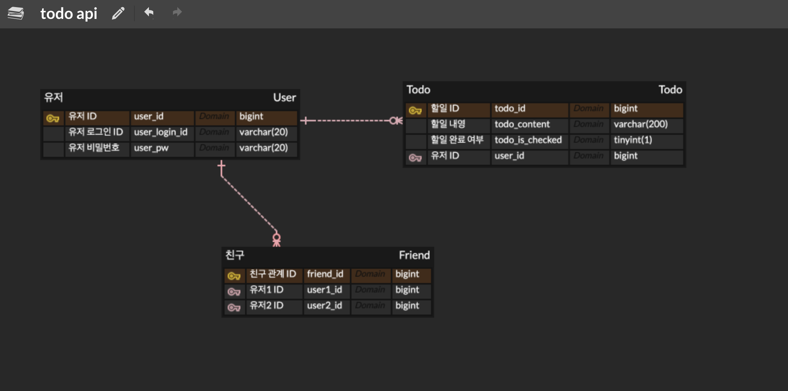

# 4주차 학습 내용

---

## DB 설계
문제 상황은 크게 개체(엔티티)와 그 사이의 관계로 나타낼 수 있다.
- 개체(Entity) : 문제 상황을 구성하는 요소
- 관계(Relationship): 개체와 개체 사이의 관계

ER Model은 다음과 같이 DB로 구현할 수 있다.
- 개체 → 테이블
- 관계 → 테이블 or 외래키
- 속성 → 테이블 컬럼

개체와 개체는 사이의 관계는 아래와 같은 종류가 있다.
- 다대일 (N : 1)
- 일대다 (1 : N)
- 일대일 (1 : 1)
- 다대다 (N : M)

ERD Cloud에서 관계를 설정할 때는 보통 비-식별 관계를 선택한다.
- 식별 관계 : 관계 대상의 PK를 자신의 PK로도 사용하는 것
- 비-식별 관계 : 관계 대상의 PK를 자신의 FK로만 사용하는 것

## JPA
- Java Persistence API
- 데이터베이스에서 읽어온 데이터를 자바 객체로 매핑하는 자바의 표준 기술 (ORM)
- 엔티티(Entity)는 자바와 데이터베이스가 소통하는 단위
- 테이블의 데이터 하나(레코드)는 엔티티 객체 하나로 매핑된다.
- 엔티티 클래스를 정의하면, JPA가 엔티티 클래스 정의를 보고 테이블을 생성하는 SQL을 알아서 작성하고 실행한다. 
  -> JPA를 사용함으로써 SQL을 작성하는 시간을 줄일 수 있다.

---

## JPA 실습

### 의존성 추가
- build.gradle에 JPA와 H2 데이터베이스 의존성을 추가한다.
- 의존성 정보가 바뀌면 반드시 gradle을 다시 로드한다.

### DB 연결 정보 추가
- resources/application.properties 파일에 DB 접속 정보를 작성한다.
- 편의를 위해 이 파일의 확장자를 yml(application.yml)로 바꾼다.

- 스프링에서는 컨테이너에 저장된 빈(객체)과 빈(객체)사이의 의존성을 프레임워크가 주입하는 것을 말한다. 

### 관리자 콘솔 접속
- 어플리케이션을 실행하고, localhost:8080/h2-console 에 접속
- JDBC URL에 application.yml 파일에 작성한 URL 입력

---

## ERD 스크린샷

