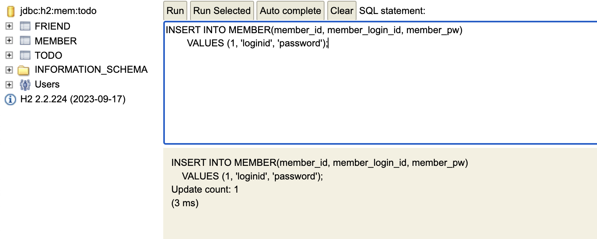
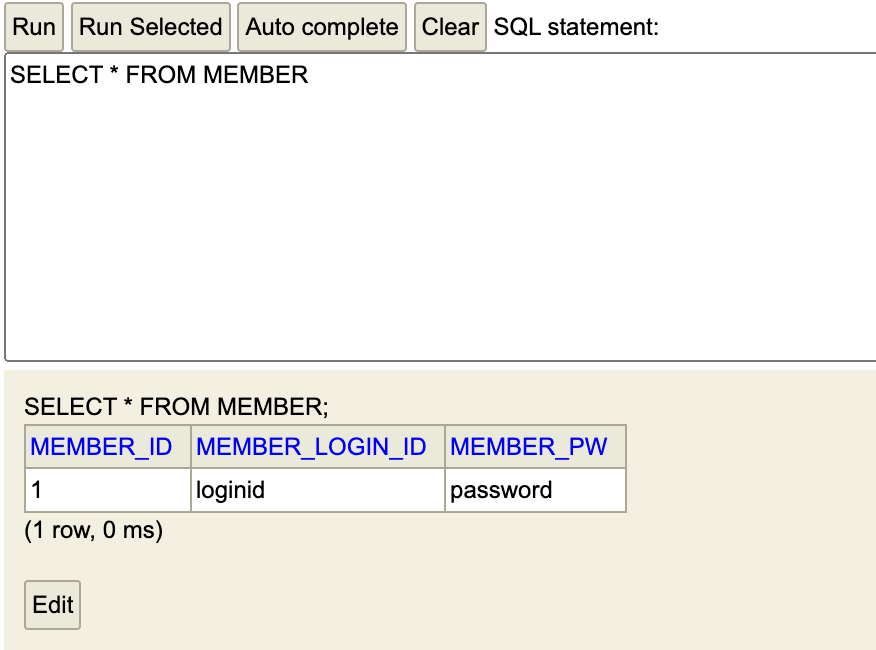
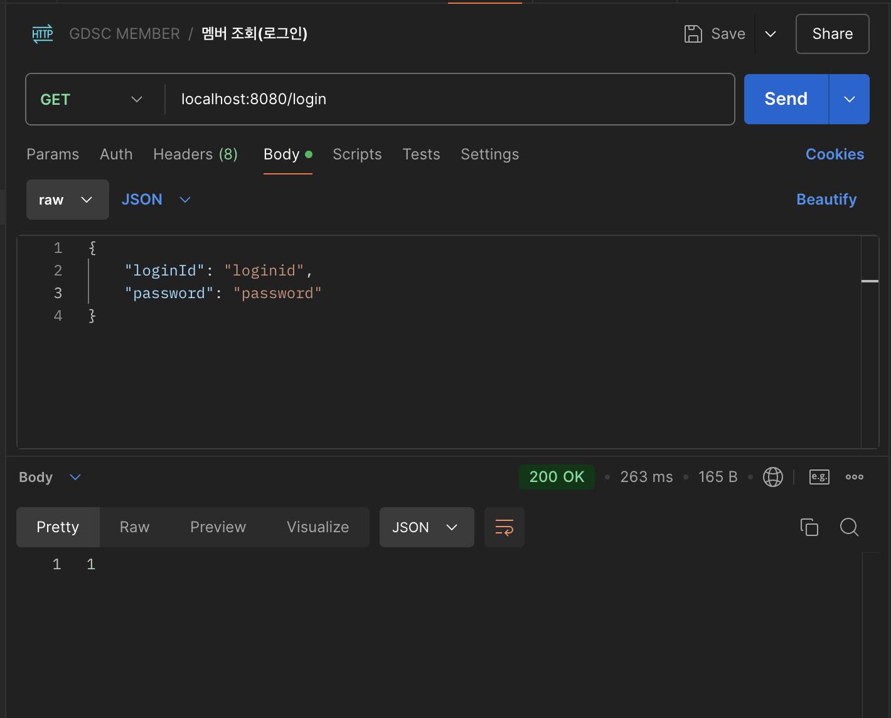
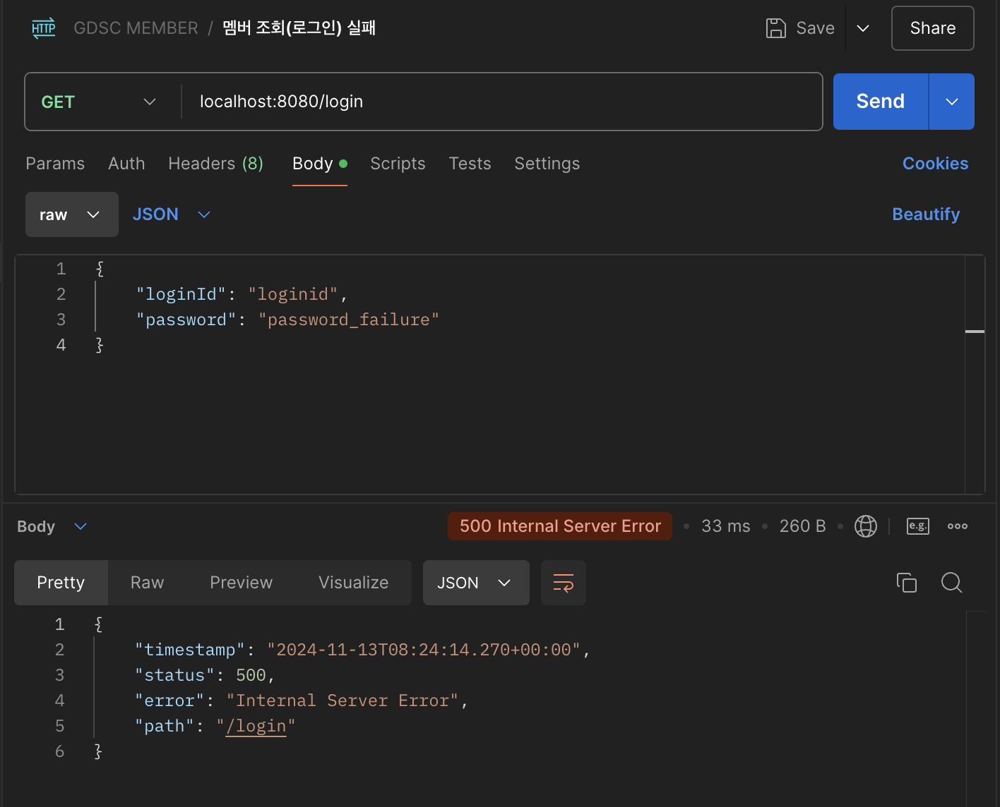
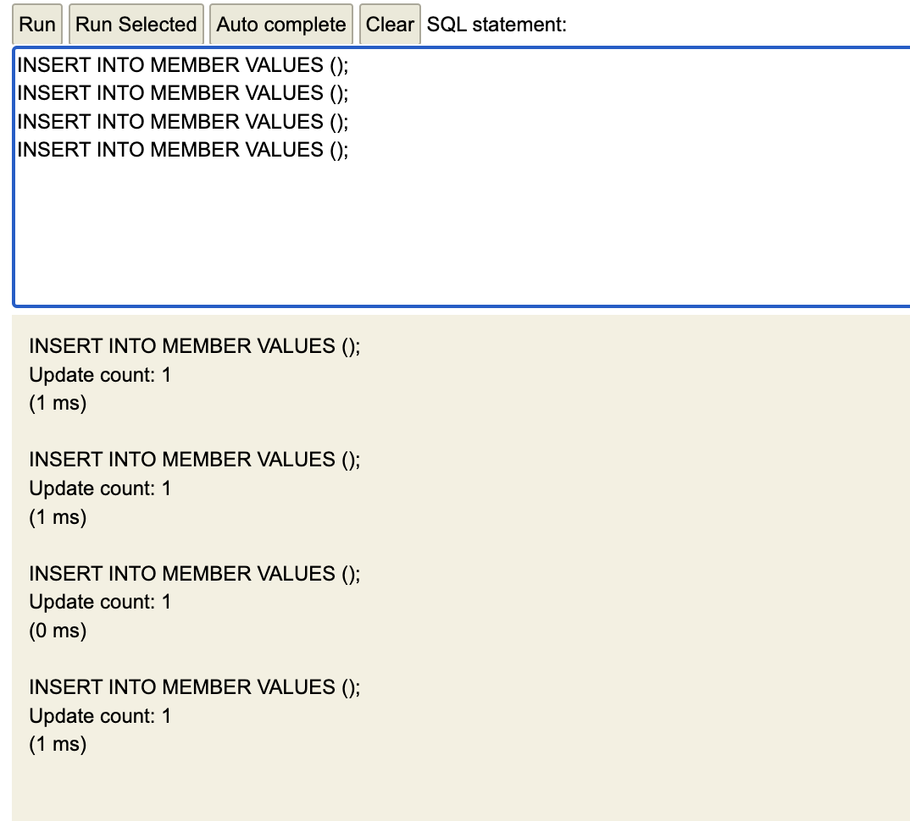
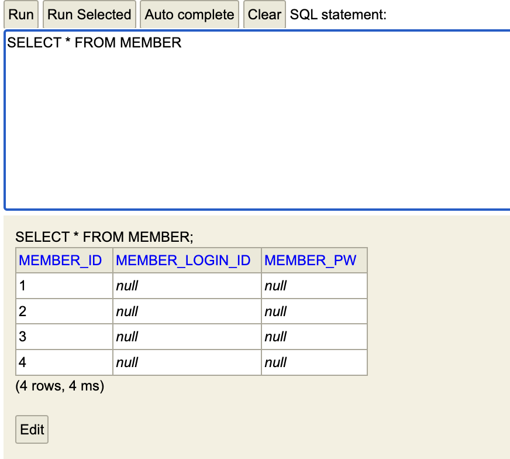
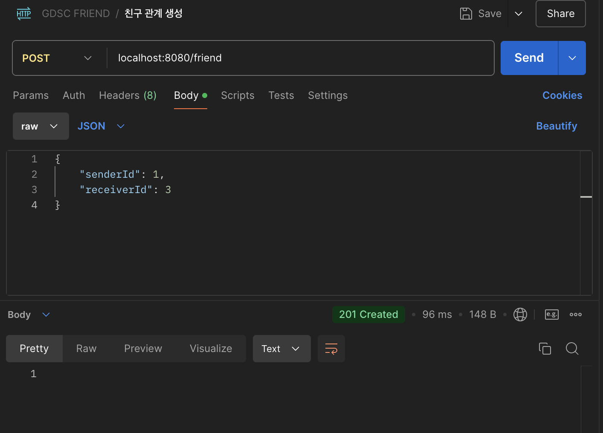
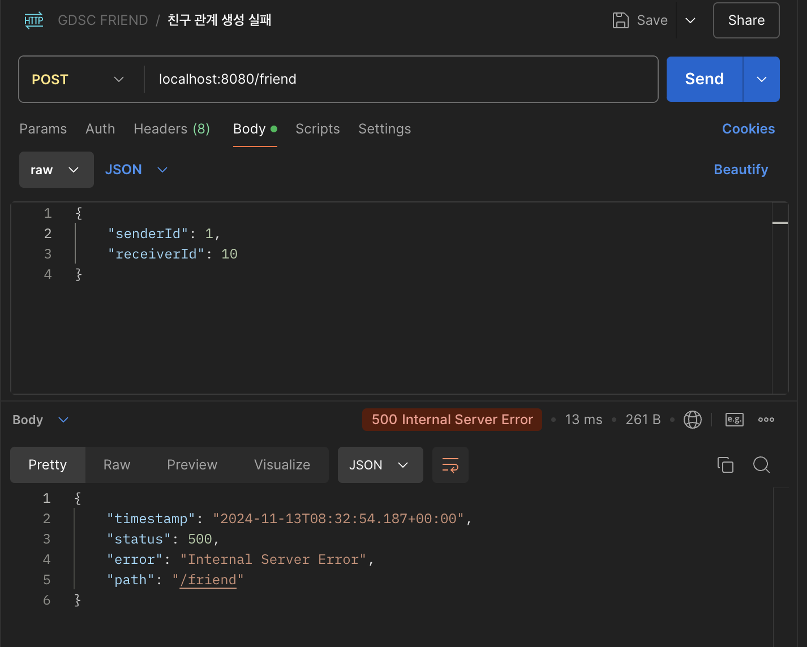

# 9주차 학습 내용

## REVIEW : 프로토콜과 HTTP

- http 요청 관련 데이터는 Request body,
  http 응답 관련 데이터는 Response body에 담는다.
- 데이터를 헤더에 담는 경우도 있으나, 스터디에서는 다루지 않았다.

## 컨트롤러 계층
- 클라이언트의 요청을 받고, 응답을 보내는 계층

- DTO (Data Transfer Object)를 사용하여
  서비스 계층과 데이터를 주고받는다.
  
- 전용 컨트롤러 속 함수의 매개변수로 http 요청을 받고,
  반환값으로 http 응답을 내보내도록 설계한다.

## 컨트롤러 클래스 생성
### @Controller
- @Controller 어노테이션을 사용하여 컴포넌트 스캔의 대상이 되도록 한다.

### @ResponseBody
- API 서버는 json 데이터를 응답하는 경우가 많으므로
  
  컨트롤러 내부의 메서드가 자바 객체를 반환했을 때,
    
  객체를 json 데이터로 변환해서 response body에 담아 응답하도록 한다.
    
  @ResponseBody 어노테이션을 통하여 구현 가능하다.

### @Service
- @Service 어노테이션을 이용하여 빈으로 등록해서 사용한다.

### @RestController
- @Controller와 @ResponseBody 대신, 편의를 위해 @RestController을 사용한다.
  
### @RequestMapping
- @RequestMapping 어노테이션을 통해

  메서드가 처리할 요청 method, url을 지정할 수 있다.

### @RequestMapping 응용(1)
- TodoController는 모든 todo 관련 요청을 처리하는 클래스이므로

  todo 관련 요청이 포함하는 url이 모두 /todo로 시작한다.
  
- 따라서 URL 앞 공통 URL은 클래스에서 지정하고,

  URL 뒤 상세 URL은 메서드에서 지정하는 방법을 채택할 수 있다.

### @RequestMapping 응용(2)
- 보통 편의를 위하여, @RequestMapping 어노테이션의 옵션으로 들어가는 method 종류는

  @PostMapping @GetMapping과 같은 특수한 어노테이션으로 지정한다.

## 컨트롤러 메서드 - 할 일 생성
### 메서드 파라미터
- Request body 데이터는 보통 json 형식으로 들어오며,

  메서드 파라미터로 받을 수 있다.

- @RequestBody를 사용하여 파라미터로 들어오는 json 데이터를
  
  자바 객체로 변환하여 받을 수 있다.
  
- 데이터를 받는 자바 객체를 DTO(Data Transfer Object) 라고 한다.
  
- DTO 클래스를 생성하여 DTO로 요청 데이터를 받을 수 있다.

  #### DTO로 요청 데이터를 받아내는 방법 외에는..?
  1. 서비스 계층에 DTO 객체를 통으로 넘기고, DTO에서 데이터를 꺼내는 과정은 서비스 계층에서 수행하는 방법
  2. 데이터를 꺼내는 대신 DTO 클래스에 Todo entity 객체로의 변환 메서드를 생성하는 방법
  
### 응답(Response) 생성
- 컨트롤러 계층은 클라이언트의 요청을 처리한 뒤

  HTTP 프로토콜에 정의된 상태코드를 사용하여

  처리 결과를 클라이언트에게 알려주어야 한다.

#### 참고) 대표적인 상태 코드
- 200 → 처리 성공 (ok)
- 201 → 데이터 생성 성공 (created)
- 400 → 클라이언트 요청 오류 (bad request)
- 404 → 요청 데이터 없음 (not found)
- 500 → 서버 에러 (internal server error)

- 스프링이 제공하는 ResponseEntity를 통해 http 응답을 만들어서 반환한다. 아래는 예시이다.
  ```
  ResponseEntity<Void>
  ResponseEntity<List<Todo>>
  ```

## 컨트롤러 메서드 - 할 일 조회

- 조회 메서드 리턴형을 ResponseEntity<List<Todo>> 대신 DTO로 구현하여도 무방하다.
  
- 조회 성공 시, 200 OK 응답 + todoList 리턴
  ```
  return ResponseEntity.ok().body(todoList)
  ```

## 컨트롤러 메서드 - 할 일 삭제
- deleteTodo 함수에 @DeleteMapping("/{todoId}") 어노테이션을,

  함수 매개변수로 @PathVariable Long todoId를 설정한다.

  이를 통해 path parameter 값을 매개변수로 받을 수 있다.

- 삭제의 경우, 보통 204 no content 상태코드를 응답한다.
  ```
  return ResponseEntity.noContent().build()
  ```
  
## 컨트롤러 메서드 - 할 일 수정
- @RequestBody, @PathVariable 사용

### 컨트롤러 테스트

- 애플리케이션 실행 후, API 요청과 응답이 정상적인지 테스트하기 위하여,

  Postman이라는 도구를 사용한다.

#### Postman 사용법(요약)
1. 로그인한 뒤 workspaces 를 클릭하여 새 워크스페이스 생성
2. Collections 탭에서 + 버튼을 눌러 빈 콜렉션을 생성
3. Add a request 링크를 클릭하여 요청을 생성
4. Todo 스프링 어플리케이션을 실행한 뒤, 할 일 생성 요청을 작성하고 send 버튼을 클릭
   (Send 버튼 활성화되지 않았다면, agent 프로그램 실행)

- 따라서 H2 콘솔에서 직접 유저를 추가한 후 테스트한다.

## todo-api 포스트맨 테스트 스크린샷

### Member Controller

#### 멤버 조회(로그인)


##### 성공 case

##### 실패 case


---

### Friend Controller

#### 친구 관계 생성(친구 요청 상태임, 승인된 친구 관계 아님.)


##### 성공 case

##### 실패 case(존재하지 않는 유저에게 친구 요청 보냄.)



